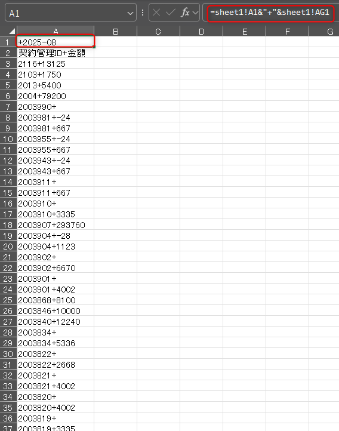

# Web版 CSV比較ツール 使い方マニュアル

## 1. はじめに

このツールは、2つのCSVファイルを行単位で比較し、どの行が追加/削除されたのか、あるいはファイル内で重複しているのかを分析します。

このマニュアルでは、比較の元となるExcelファイルから **「比較用のCSVファイル」を準備する手順** と、**Webツールの操作方法** を説明します。

---

## 2. Step 1: 比較用CSVファイルの準備（Excelでの作業）

このツールは、各行がユニーク（一意）なデータであることを前提として比較を行います。
しかし、元のExcelファイルの「契約管理ID」のように、単一の列だけではデータが重複していて比較できない場合があります。

そのため、最初にExcel上で複数の列を結合し、**比較用の「ユニークキー」** を作成する必要があります。

### 2.1. ユニークキーの作成

1. 比較したいExcelファイル（例: `テストー前から.xlsx`）を開きます。
2. 新しいSheet2を作成し（例: A列）に、1行目に「ユニークキー」などのヘッダー名を入力します。
3. 2行目のセルに、ユニークにしたい列を結合する数式を入力します。
    - 例: `A列`の「契約管理ID」と`AG列`の「2025-08の金額」を結合する場合
    - **数式: `sheet1!A2&"+"&sheet1!AG2`**
    - この数式により、`2003990` と `13125` が `2003990+13125` という一つの文字列になります。

    

4. 数式を入力したセルの右下隅（フィルハンドル）をダブルクリックし、最終行まで数式をコピーします。

    

### 2.2. CSVファイルとして保存

1. Excelで新しいシートを追加します。
2. 先ほど作成した「ユニークキー」のSheet2のA列（ヘッダー行を含む）この新しいシートだけが表示されている状態で、`ファイル` > `名前を付けて保存` を選択します。
3. ファイルの種類で **「CSV UTF-8 (コンマ区切り)(*.csv)」** を選択し、`File_A.csv` のような名前で保存します。

    

4. **比較したいもう一方のExcelファイル（例: `テスト－後から.xlsx`）でも、上記 2.1 と 2.2 の手順を繰り返し、`File_B.csv` を作成します。**

### 2.3 1行目を削除

1. 1行目がヘッダとして識別します。保存したFile_A.csv,File_B.csvを開いて1行目をヘッダ、2行目以降からデータが始まるようにします。

    
    

---

## 3. Step 2: Webツールでの比較

比較用のCSVファイルが2つ準備できたら、Webツールで比較を実行します。

### 3.1. ファイルの選択

1. 画面の「File A」エリアにある **「ファイルを選択」** ボタンをクリックし、先ほど作成した `File_A.csv` を選びます。
2. 同様に、「File B」エリアで `File_B.csv` を選びます。

    

### 3.2. 比較の実行

2つのファイルを選択したら、青い **「比較実行」** ボタンをクリックします。

### 3.3. 結果の確認とダウンロード

1. **サマリー表示**: 処理が終わると、画面に分析結果の概要が表示されます。
2. **ZIPダウンロード**: 同時に、詳細な分析結果を含むZIPファイル (`analysis_results.zip`) が自動でダウンロードされます。

    

---

## 4. ダウンロードされるファイルの内容

ダウンロードされた `analysis_results.zip` ファイルには、以下の6つのファイルが含まれています。
各CSVファイルの1列目には、元のファイルでの行番号が記載されています。

- **`only_in_File_A.csv`**: 「File A」にのみ存在した行のリスト
- **`only_in_File_B.csv`**: 「File B」にのみ存在した行のリスト
- **`in_both.csv`**: 両方のファイルに共通して存在した行のリスト
- **`duplicates_in_File_A.csv`**: 「File A」のファイル内で内容が重複していた行のリスト
- **`duplicates_in_File_B.csv`**: 「File B」のファイル内で内容が重複していた行のリスト
- **`README.md`**: 上記5つのファイルについての説明が書かれたドキュメント

---

## 5. 補足: ツールの特徴

- **インストール不要**: Webブラウザだけで動作します。
- **セキュア**: ファイルは外部のサーバーに送信されず、すべての処理はご自身のPC内で完結するため、安心してご利用いただけます。
